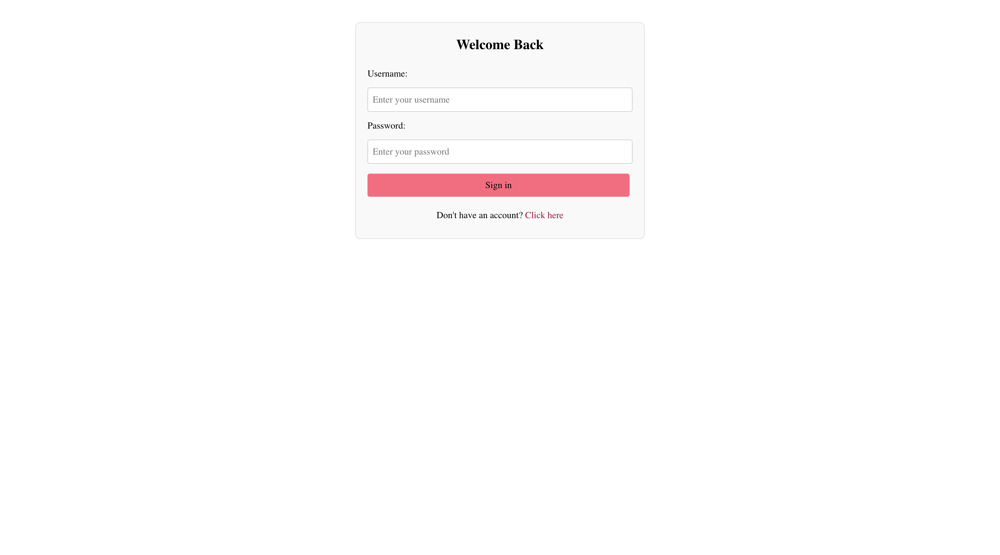
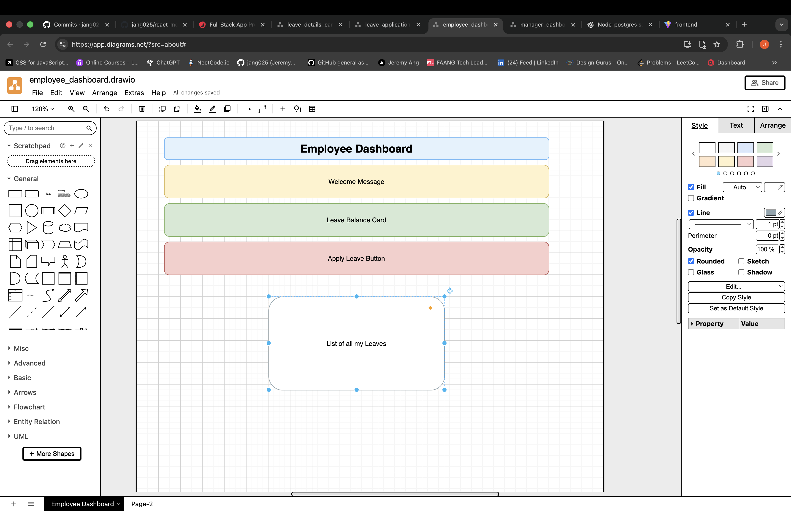

# Leave Management System

## 5.1 Screenshot / Logo



## 5.2 About the App

### App Name: Leave Management System

#### Description

<p>This is a full-stack leave management system that allows employees to apply for leave and managers to approve or reject leave requests. Employees can track balances for annual and sick leave, while managers have a full view of pending leave requests.</p>

#### Why I Built This

<p>I built this app to learn full-stack development (React + Express + PostgreSQL), improve authentication and authorization skills, and practice working with real-world relational data.</p>

## 5.3 Getting Started

### Planning Materials



### To get started working on this project

#### Follow the steps below to run the project locally

1. Clone the Repository

```
git clone https://github.com/jang025/Leave-Management-System
```

2. Configure Environment Variables
   Create .env files for both the backend and frontend, and fill in the required values.
   Follow the env.example format for more information.

```
backend/.env
frontend/.env
```

3. Install Dependencies
   Run the following in both the backend and frontend folders:

```
npm install
```

4. Start the Development Servers

```
  cd backend
  npm run dev
```

```
 cd frontend
 npm run dev
```

## 5.4 Attributions (APA Style)

Chat GPT was used to generate the css module styles for this project

## 5.5 Technologies Used

### Front-End

- React.js

- React Router

- CSS Modules

- Day.js

### Back-End

- Node.js

- Express.js

- PostgreSQL

- JWT Authentication

- Bcrypt

## 5.6 Next Steps (Future Enhancements)

- Add email notifications for leave approvals.

- Add pagination and filtering for managers.

- Add loading states and error states on the Frontend
